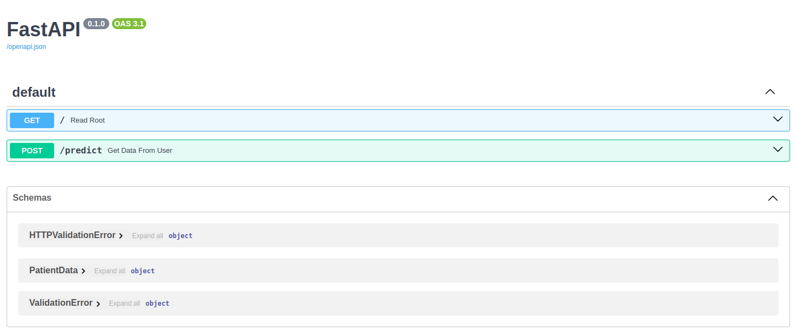
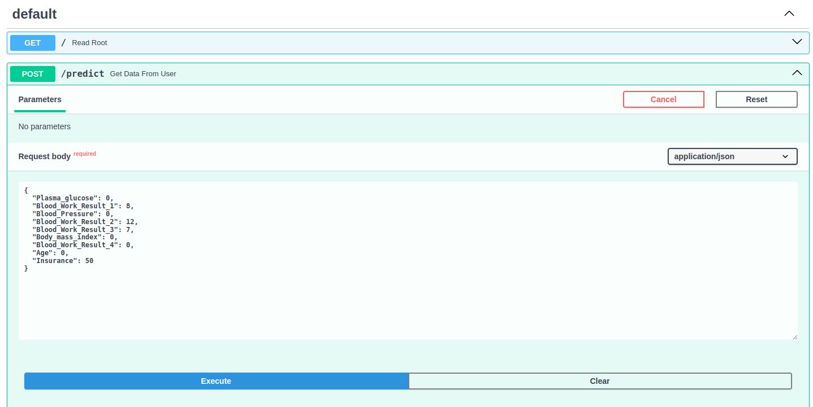
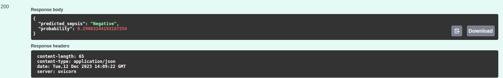

#  Machine-learning model Dockerized FastAPI Sepsis Prediction

## Description 

Welcome to the Sepsis Prediction FastAPI application!

This application allows you to predict sepsis in patients using a machine-learning model.

## Introduction

 In this project, we'll develop a FastAPI web application that predicts whether a patient has sepsis based on various medical attributes.

## Setup
Install the required packages to be able to run the evaluation locally.

You need to have [`Python 3`](https://www.python.org/) on your system (**a Python version lower than 3.10**). Then you can clone this repo and being at the repo's `root :: repository_name> ...`  follow the steps below:

- Windows *(Python should be added to the Path variable of environment)*:
        
        python3 -m venv venv; venv\Scripts\activate; python -m pip install --upgrade pip; python -m pip install -r requirements.txt  

- Linux & MacOs:
        
        python3 -m venv venv; source venv/bin/activate; python -m pip install --upgrade pip; python -m pip install -r requirements.txt

The both long command-lines have a same structure, they pipe multiple commands using the symbol **;** but you may manually execute them one after another.

1. **Create the Python's virtual environment** that isolates the required libraries of the project to avoid conflicts;
2. **Activate the Python's virtual environment** so that the Python kernel & libraries will be those of the isolated environment;
3. **Upgrade Pip, the installed libraries/packages manager** to have the up-to-date version that will work correctly;
4. **Install the required libraries/packages** listed in the `requirements.txt` file so that it will be allow to import them into the python's scripts and notebooks without any issue.

#### Getting Started

To run this application, follow these steps:

- Clone the Repository: Clone this repository to your local machine.

- Navigate to the Directory: Open a terminal and navigate to the cloned repository directory.

- Install Docker: Ensure that you have Docker installed on your machine.

- Build the Docker Image
- Run the dockeer image using the following command:

*docker build -t ml-sepsis-prediction-app .*

Run the Docker Container: Once the image is built, run the Docker container using the following command:
*docker run -p 8000:8000 ml-sepsis-prediction-app*

#### Input example

#### Output example

#### Summary

 | Project's Name | Published Article  | Deployed App |Docker Hub Repository|
|:--------------:|:--------------:|:--------------:|:--------------:|
| ML_Sepsis_API_Project|[Project Article](https://www.linkedin.com/pulse/classification-machine-learning-fastapi-sepsis-imanirakarama-4ivkf/) |    [Deployed App](https://imalexianne-ml-sepsis-fastapi.hf.space)| [Docker Hub](https://hub.docker.com/repository/docker/imalexianne/fastapi_sepsis_prediction/general)
  
#### Author

Alexianne Imanirakarama

email:<imalexianne@gmail.com>

My LinkedIn:<https://www.linkedin.com/in/imalexianne>

